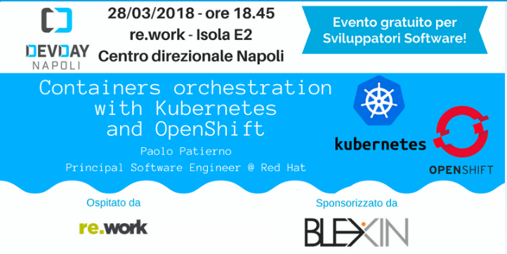

# DevDay "Containers orchestration with Kubernetes and OpenShift"

This repo is used for hosting the demo showed during the "Containers orchestration with Kubernetes and OpenShift" meetup 
in Naples (March 28th, 2018) and organized by [DevDay](http://www.devday.it/) community.

Following the links to the resources for this meetup :

* [slides](https://www.slideshare.net/paolopat/containers-orchestration-with-kubernetes-and-openshift) on Slideshare

Following the different examples provided in this demo.

* [Pods](01-pods/01-pods.md)
* [ReplicaSets](02-replicasets/02-replicasets.md)
* [Services](03-services/03-services.md)
* [Volumes](04-volumes/04-volumes.md)
* [ConfigMaps](05-configmaps/05-configmaps.md)
* [Deployments](06-deployments/06-deployments.md)
* [Ingress](07-ingress/07-ingress.md)

The Vert.x based applications used into the Docker images for this playground can be built as described [here](./vertx-http-app/README.md).
